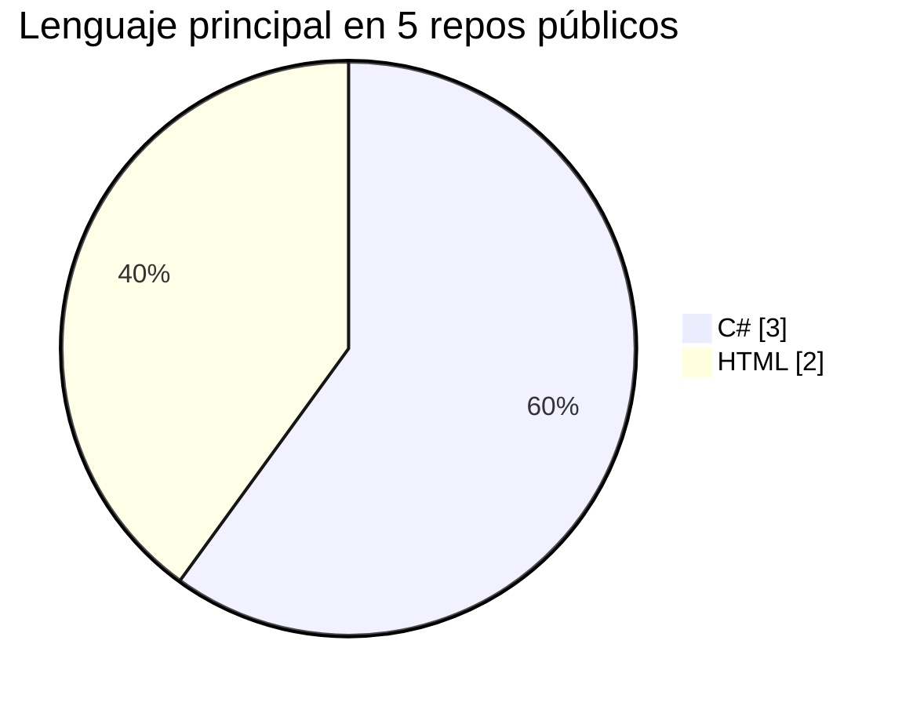
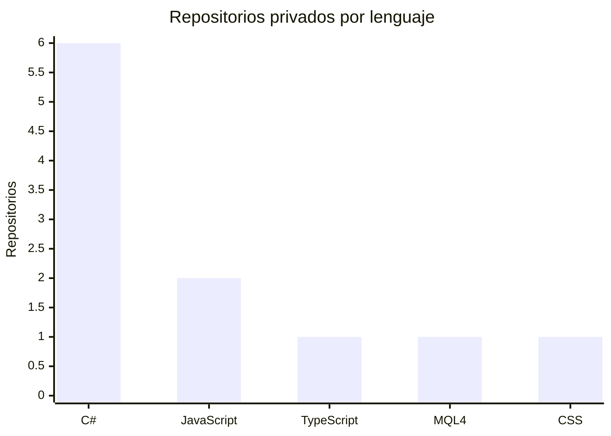
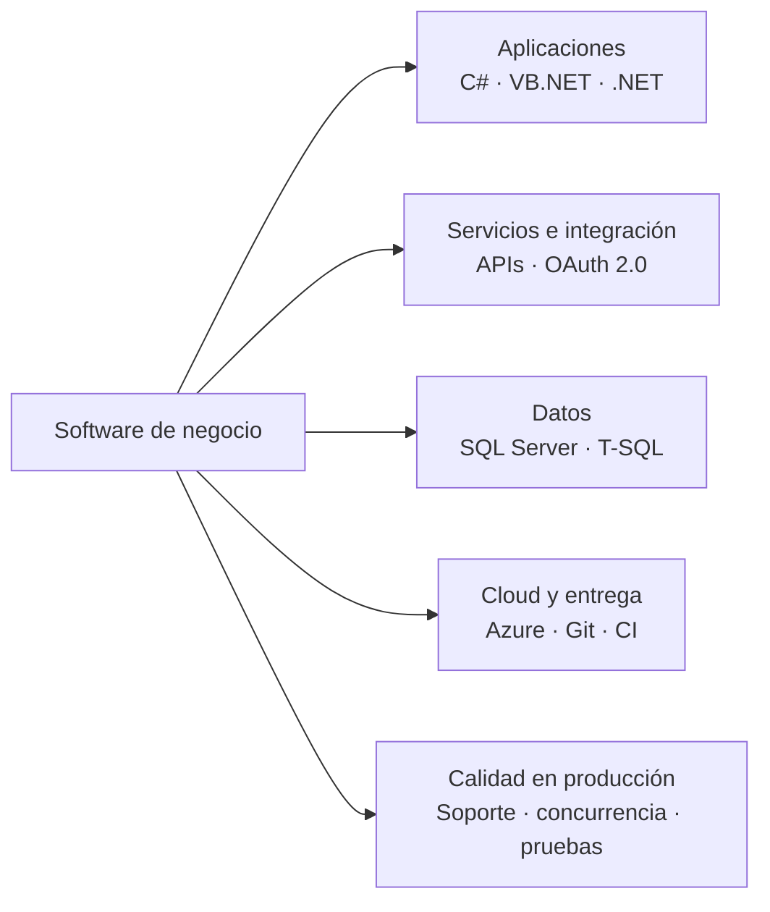

 

### SOFTWARE DEVELOPER · .NET · PRODUCTO EMPRESARIAL

**Desarrollo y evolución de software de negocio: del requisito y los datos hasta la entrega y el soporte.**

[Portfolio ↗](https://danidevsdbk.github.io/Portfolio.v2/) · [Escríbeme ↗](mailto:danidevsdbk@gmail.com) · [GitHub ↗](https://github.com/DaniDevSDBK)

 

[Sobre mí](#hola-soy-danidev) · [Experiencia](#cómo-trabajo) · [Proyectos](#proyectos-seleccionados) · [Stack](#stack) · [IA aplicada](#ia-como-herramienta-de-ingeniería)

---

## Hola, soy DaniDev

Soy desarrollador de software con experiencia profesional desde 2023. Trabajo principalmente con **C#/.NET, VB.NET, SQL Server, APIs y Azure**, desarrollando y manteniendo software empresarial que ya forma parte de la operativa diaria de sus usuarios.

Mi experiencia combina evolución de ERP en producción, aplicaciones B2B independientes, integración de sistemas, soporte a clientes y producto propio. Me muevo entre reglas de negocio, servicios, persistencia, interfaz, validación y releases; también sigo las incidencias hasta entender su causa y resolverlas de forma sostenible.

<strong>English summary</strong>

 

Software Developer focused on .NET and business products, with professional experience since 2023. I build and maintain production ERP features, standalone B2B applications, APIs and integrations using C#/.NET, VB.NET, SQL Server and Azure. I also work on production support, reliability, code reviews, integration testing and AI-assisted engineering. I own the technical decisions and review the changes I deliver.

## Cómo trabajo

| Área | Experiencia aplicada |
|:--|:--|
| **Producto y negocio** | Desarrollo de funcionalidades de extremo a extremo para sistemas empresariales y aplicaciones B2B. |
| **APIs e integración** | Contratos, persistencia e intercambio de datos conectados con flujos de trabajo existentes. |
| **Fiabilidad** | Diagnóstico de concurrencia y condiciones de carrera; integración de borrado lógico y sus efectos en consultas y procesos. |
| **Entrega y soporte** | Investigación de incidencias de producción, atención a usuarios, code review, CI y pruebas de integración. |
| **Automatización con IA** | Diseño y uso de flujos de agentes para apoyar análisis, planificación, implementación y diseño de pruebas; reviso e integro los resultados. |

## Proyectos seleccionados

### Inventar.io · producto en uso real

Aplicación multiusuario de gestión de inventario usada por clientes reales. He diseñado casi toda la arquitectura y la base del backend en C#; la IA me ha apoyado principalmente en la implementación del frontend. El código de la aplicación es privado; la página pública presenta el producto sin exponer datos de clientes.

[Ver el caso en el portfolio ↗](https://danidevsdbk.github.io/Portfolio.v2/#inventario) · [Página pública del producto ↗](https://github.com/DaniDevSDBK/Inventar.io.info)

### Herramientas y aplicaciones

<table>
  <tr>
    <td width="33%" valign="top">
      
      <h3><a href="https://github.com/DaniDevSDBK/ProjectDI_WPF">ProjectDI_WPF ↗</a></h3>
      
Biblioteca personal de videojuegos, catálogo conectado a FreeToGame y recomendaciones según preferencias.

      C# · WPF · SQLite
    </td>
    <td width="33%" valign="top">
      
      <h3><a href="https://github.com/DaniDevSDBK/PManager">PManager ↗</a></h3>
      
Aplicación de escritorio para gestionar credenciales, con generador de contraseñas y almacenamiento con RSA.

      C# · WPF · MVVM
    </td>
    <td width="33%" valign="top">
      
      <h3><a href="https://github.com/DaniDevSDBK/Statsfy">Statsfy / MauiTune ↗</a></h3>
      
Aplicación experimental multiplataforma que conecta OAuth 2.0 con la API de Spotify.

      C# · .NET MAUI · OAuth 2.0
    </td>
  </tr>
</table>

[Ver el código del portfolio ↗](https://github.com/DaniDevSDBK/Portfolio.v2) · [Abrir portfolio publicado ↗](https://danidevsdbk.github.io/Portfolio.v2/)

## Stack

<strong>Lenguaje principal de mis repositorios públicos</strong> Cuenta repositorios, no líneas de código ni nivel de dominio.

<strong>Lenguaje principal en mis repositorios privados</strong> 11 repositorios con lenguaje identificado · distribución por repositorio, no por líneas de código.

<strong>Cómo conecto las áreas de trabajo</strong>

<table>
  <tr>
    <td width="50%" valign="top"><strong>🧩 Producto</strong> ERP · aplicaciones B2B · desarrollo de funcionalidades de extremo a extremo</td>
    <td width="50%" valign="top"><strong>🔌 Integración</strong> APIs · OAuth 2.0 · intercambio y mapeo de datos</td>
  </tr>
  <tr>
    <td width="50%" valign="top"><strong>🛡️ Fiabilidad</strong> Concurrencia · condiciones de carrera · soft delete · seguridad</td>
    <td width="50%" valign="top"><strong>🚀 Entrega</strong> Azure · CI · revisión de código · pruebas de integración · soporte de producción</td>
  </tr>
</table>

## IA como herramienta de ingeniería

He construido y puesto en uso un sistema de agentes especializado en software ERP. Lo aplico como apoyo para analizar trabajo, preparar planes técnicos, implementar cambios y diseñar revisiones y pruebas. **La IA acelera tareas; yo aporto el contexto, reviso los cambios y decido qué se integra.** Mantengo privados los prompts y detalles internos del sistema.

OBJETIVO → ANÁLISIS Y PLAN → IMPLEMENTACIÓN → REVISIÓN HUMANA → PRUEBAS

---

### ¿Necesitas evolucionar un producto o resolver un problema de software?

[Hablemos ↗](mailto:danidevsdbk@gmail.com) · [Portfolio completo ↗](https://danidevsdbk.github.io/Portfolio.v2/)

DaniDev · Software Developer · © 2026

